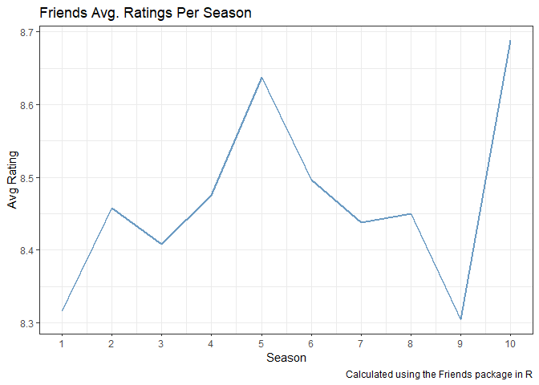
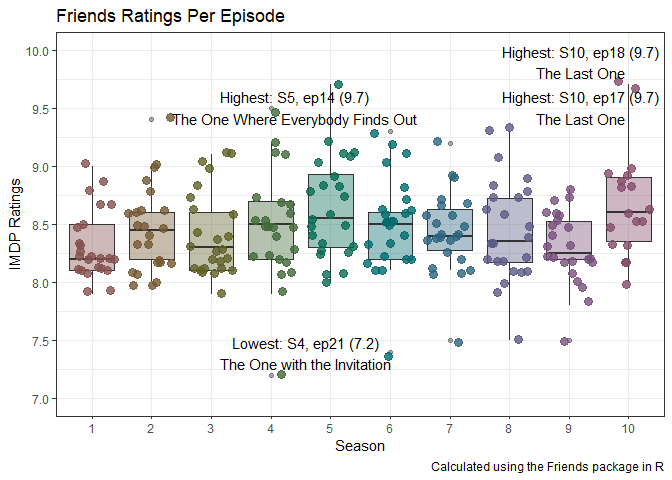

Friends
================
Sihlelelwe Nzima
2026-05-14

# Purpose

The purpose of this fun project is to display the data analytics behind
the show lines of the American sit-com “Friends”.

Data description: Lines spoken matched to the season, episode, scene,
and tone in which they’re spoken by the various characters in the show
(699 total major & minor characters). Dataset contains 4 dataframes:
friends, friends_emotions (emotion), friends_entities, friends_info
(show production details)

# Data

``` r
pacman::p_load(friends, scales) #loading lines from the show
print(friends_info)
```

    ## # A tibble: 236 × 8
    ##    season episode title      directed_by written_by air_date   us_views_millions
    ##     <int>   <int> <chr>      <chr>       <chr>      <date>                 <dbl>
    ##  1      1       1 The Pilot  James Burr… David Cra… 1994-09-22              21.5
    ##  2      1       2 The One w… James Burr… David Cra… 1994-09-29              20.2
    ##  3      1       3 The One w… James Burr… Jeffrey A… 1994-10-06              19.5
    ##  4      1       4 The One w… James Burr… Alexa Jun… 1994-10-13              19.7
    ##  5      1       5 The One w… Pamela Fry… Jeff Gree… 1994-10-20              18.6
    ##  6      1       6 The One w… Arlene San… Adam Chas… 1994-10-27              18.2
    ##  7      1       7 The One w… James Burr… Jeffrey A… 1994-11-03              23.5
    ##  8      1       8 The One W… James Burr… Marta Kau… 1994-11-10              21.1
    ##  9      1       9 The One W… James Burr… Jeff Gree… 1994-11-17              23.1
    ## 10      1      10 The One w… Peter Bone… Adam Chas… 1994-12-15              19.9
    ## # ℹ 226 more rows
    ## # ℹ 1 more variable: imdb_rating <dbl>

# Visualisations

``` r
friends_info %>% 
    group_by(season) %>% #average ratings for each season
    summarise(mean_rating = mean(imdb_rating)) %>% 
    ggplot() + geom_line(aes(season, mean_rating), color = "steelblue", size = 1.0, alpha = 0.8) + 
  scale_x_continuous(breaks = c(1:length(unique(friends_info$season)))) + 
  theme_bw() + 
  labs(x = "Season", y = "Avg Rating", caption = "Calculated using the Friends package in R",
       title = "Friends Avg. Ratings Per Season") +
    theme_bw()
```


Friends generally performed well with the minimum rating being above 8
(out of 10). The highest average rating occurs in Season 9, while the
lowest is at the end of Season 8.

``` r
library(ggrepel)

viewership_plot <- friends_info %>%
    mutate(Text = ifelse(imdb_rating == min(imdb_rating, na.rm=T), glue::glue("Lowest: S{season}, ep{episode} ({imdb_rating})\n{title}"), 
                        ifelse(imdb_rating == max(imdb_rating, na.rm=T), glue::glue("Highest: S{season}, ep{episode} ({imdb_rating})\n{title}"),
                               NA_character_))) %>% #creating labels for special episodes i.e those with the lowest & highest ratings, otherwise no label for normal episodes (avoids cluttering the visualisation)
    mutate(season = as.character(season)) #ensures season (numbers) are viewed as categorical insteady of continuous numbers


viewership_plot$season <- factor(viewership_plot$season, levels = as.character(1:10)) #forces consecutive ordering of seasons

viewership_plot %>% 
  ggplot() + 
  geom_boxplot(aes(x = season, y = imdb_rating, fill = season), alpha = 0.4) + 
  geom_jitter(aes(season, imdb_rating, color = season), size = 3, alpha = 0.8) + 
  scale_y_continuous(limits = c(7, 10), breaks = scales::breaks_pretty(n = 6)) + 
  ggrepel::geom_text_repel(aes(x = season, y = imdb_rating, label = Text), 
                           force = T ) + #ggrepel prevents text overlapping 
  theme_bw() + 
  labs(x = "Season", y = "IMDP Ratings", caption = "Calculated using the Friends package in R",
       title = "Friends Ratings Per Episode") + 
  scale_fill_hue(l=40, c=35) + 
  scale_color_hue(l=40, c=35) + 
  guides(fill = F, color = F)
```


More descriptive visualisation of average ratings. Joint highest ratings
at 9.7 are from episodes 17, 18, and 14 from seasons 10 and 5
respectively. Conversely, the lowest ratings, 7.2, are found in episode
21, season 4.
